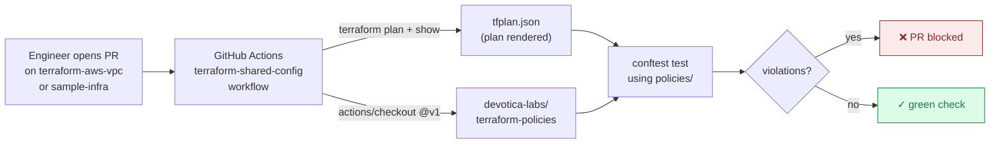

# terraform-policies

[](LICENSE)

Open Policy Agent (OPA) / conftest rule pack consumed at PR-time by every Devotica module repo and project monorepo. Pulled in by [`terraform-shared-config`](https://github.com/devotica-labs/terraform-shared-config) workflows.

> **Why this repo exists.** A single, versioned, auditable source of policy. When RBI updates a guideline or PCI-DSS adds a control, it lands here as a Rego rule and propagates to every consumer on their next `@vX.Y.Z` bump — no scattered checklists, no human-judgement gates.

## How it fits together



## What's enforced (v1.0.0)

| # | Policy | Catches | Foundation Plan ref |
|---|---|---|---|
| 01 | [`mandatory_tags`](./policies/01_mandatory_tags.rego) | Any taggable AWS resource missing one of the six required tags (Environment, Project, Owner, CostCenter, ManagedBy, Repo) | §15.2 |
| 02 | [`no_public_s3`](./policies/02_no_public_s3.rego) | S3 buckets with weak public-access blocks, public-read ACLs, or legacy `acl="public-*"` | §11.2 |
| 03 | [`encryption_required`](./policies/03_encryption_required.rego) | Unencrypted RDS, RDS Cluster, EBS, S3 SSE config, OpenSearch, EFS | §11.2 |
| 04 | [`no_iam_wildcards`](./policies/04_no_iam_wildcards.rego) | IAM policies with `Effect=Allow` + `Action="*"` or `Resource="*"` (waiver: `DevoticaWaiver` tag) | §11.2 |
| 05 | [`no_open_sg_ingress`](./policies/05_no_open_sg_ingress.rego) | Prod security groups allowing 0.0.0.0/0 or ::/0 ingress (waiver: `DevoticaWaiver=public-edge` for ALB/CloudFront) | §11.2 |
| 06 | [`stateful_protection`](./policies/06_stateful_protection.rego) | Prod RDS / RDS Cluster / ALB without deletion protection; KMS deletion window < 7 days; DynamoDB without PITR | §11.2 |

Each policy file starts with a comment block explaining what it catches, why, and which Foundation Plan section it traces to.

## Consumer integration (already wired)

`terraform-shared-config` / `terraform-module-ci.yml` and `terraform-project-ci.yml` already include a conftest job that fetches this repo and runs `conftest test` on every PR's rendered plan. Consumers don't need to do anything — pin to `terraform-shared-config@v1` and the policies apply automatically.

If you want to consume directly, the pattern is:

```yaml
- uses: actions/checkout@v4
  with:
    repository: devotica-labs/terraform-policies
    ref: v1
    path: .policies

- name: Render plan as JSON
  run: |
    terraform plan -out=tfplan.binary
    terraform show -json tfplan.binary > tfplan.json

- uses: instrumenta/conftest-action@v0.5.1
  with:
    files: tfplan.json
    policy: .policies/policies/
```

## Adding a new policy

1. Create `policies/NN_<short_name>.rego` — pick the next free `NN`
2. Use `package main` and the `deny contains msg if { ... }` style — same pattern as existing policies
3. Reuse helpers from `policies/helpers.rego` (`planned_resources`, `tags_of`, `is_open_cidr`, etc.)
4. Add a passing case to `tests/fixtures/passing_plan.json`
5. Add a failing case to `tests/fixtures/violating_plan.json`
6. Add a row to the table above
7. Open a PR — CI will assert both fixtures behave correctly

## Waivers

Some rules support per-resource waivers via tags. The convention is:

```hcl
tags = merge(local.mandatory_tags, {
  DevoticaWaiver = "public-edge"   # explicit reason
})
```

Each waiver MUST include a non-empty reason. Waivers are reviewed at code-review time — they are NOT a policy bypass, they are a recorded exception.

## Versioning

Strict semver via Git tags. Consumers pin `@v1` (auto-tracking) or `@v1.2.3` (exact).

- **Major** — adding a new mandatory tag, removing a waiver mechanism, changing helper signatures
- **Minor** — adding a new policy (existing modules pass; new ones must comply)
- **Patch** — fixing a false-positive in an existing policy

## Local testing

```bash
# Format check
opa fmt --diff policies/

# Parse + type check
opa check policies/

# Run against the passing fixture (should be silent)
conftest test tests/fixtures/passing_plan.json -p policies/

# Run against the violating fixture (should print 5+ failures)
conftest test tests/fixtures/violating_plan.json -p policies/
```

## License

Apache-2.0. See [LICENSE](./LICENSE).
